# Result Management System

## Introduction

A Result management system used any school student results, certificate manage. Manages Administrative control along with standard access to teachers and students for all necessary result-related facilities. The school result management system is very unique application. You can used the application for your institution.

This is a simple result management system written in C#, that has some basic features of result management methodologies.

## Technology and Frameworks

- C#
- .NET 4.8
- MYSQL


## Directory Structure

- **0-database** : Contains the database of the system.
- **1-soruce**   : Contains source code of the project.

- **github-readme-contents**   : Contains GitHub readme assets.


## Configuration & Setup

**Step 01:** The source code is found on the "1-source" directory.

**Step 02:** The database is found on the "0-database" folder, deploy it in a MySQL database engine Ex: phpMyAdmin.

## System Explained

### Login Page

This is the login page of this system where the admin needs to enter the username and password to authenticate into the system.

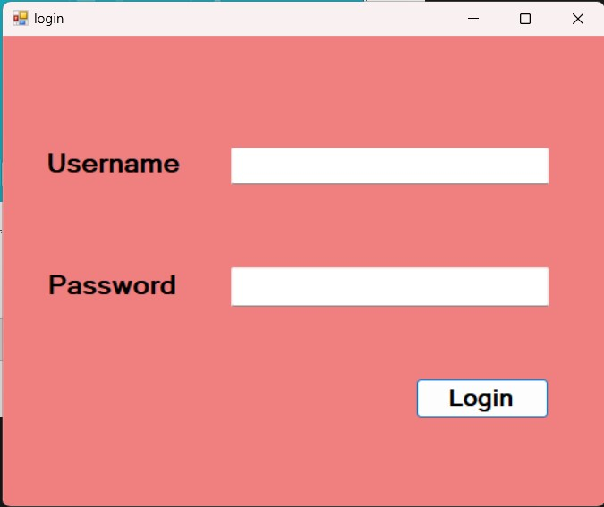


### Loading Screen

This is the loading screen of the system, it appears after the successful login.

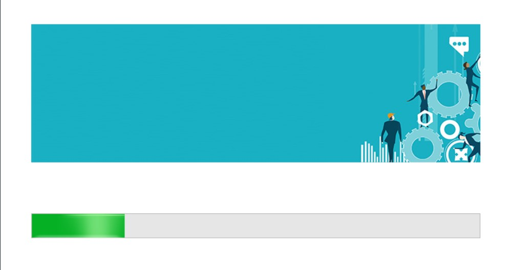

### Dashboard

This system has a simple UI for the dashboard, it has the following modules.

- **Students Module:** Has features to manage student data such as registering, deleting, updating etc.

  - **Sub Modules**
    - Add Students Module
    - Manage Students Module


- **Courses Module:**: Has features to manage course data such as course title, department and, etc.

  - **Sub Modules**
    - Add Courses Module
    - Manage Courses Module


- **Batches Module:**: Has features to manage batches such as adding batch number, updating, deleting and, etc.

  - **Sub Modules**
    - Cerate Batches Module
    - Manage Batches Module


- **Subjects Module:**: Has features to manage subjects such as updating, adding, deleting subjects and etc.

  - **Sub Modules**
    - Add Subjects Module
    - Manage Subjects Module
    - Show All Subjects Module


- **Results Module:** Has features to manage results such as provide results for students and, etc.

- **Sub Modules**
  - Add Results Module
  - Manage Results Module


- **Settings Module:** Has features to change credentials of the system.

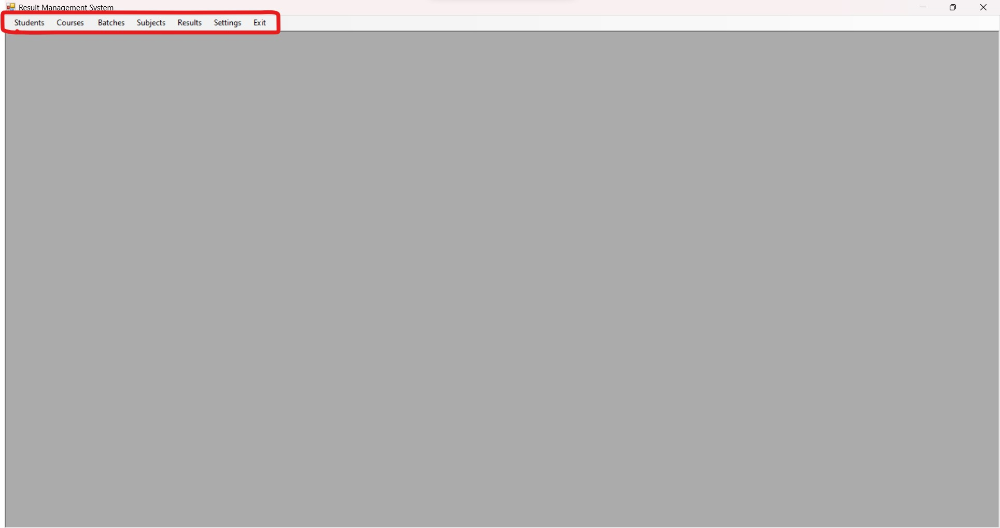


### Student Module

#### Add Students Module

##### Features
- Add students.
- Clear textboxes.
- Date picker
- Gridview of added students

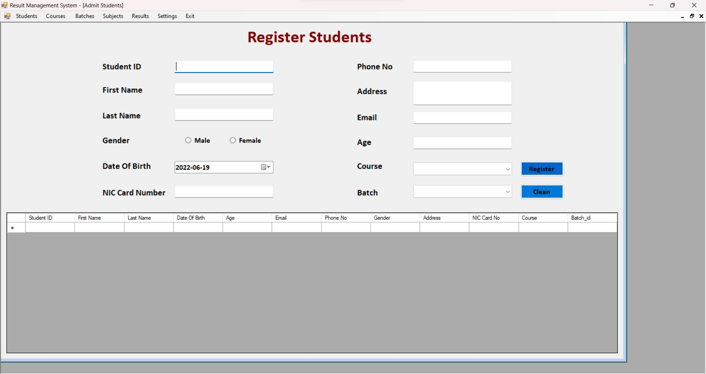


#### Manage Students Module

##### Features
- Delete students.
- Update students.
- Search students.
- Gridview of added students

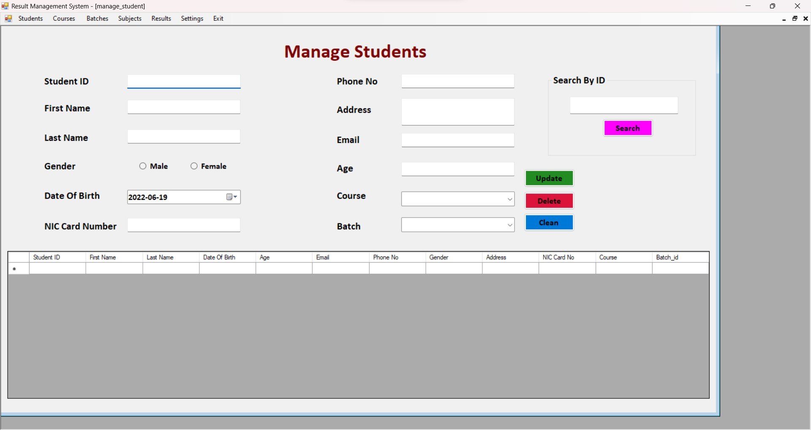


### Courses Module

#### Add Courses Module

##### Features
- Add courses.
- Gridview of added courses.

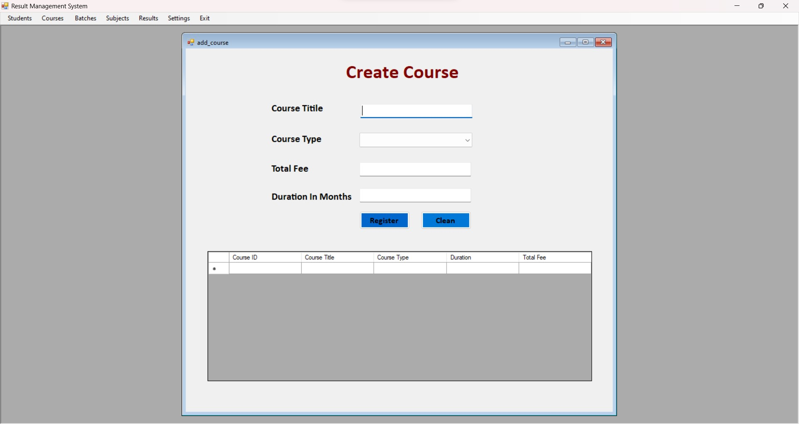


#### Manage Courses Module

##### Features
- Delete Courses.
- Update Courses.
- Search Courses.
- Gridview of added Courses.

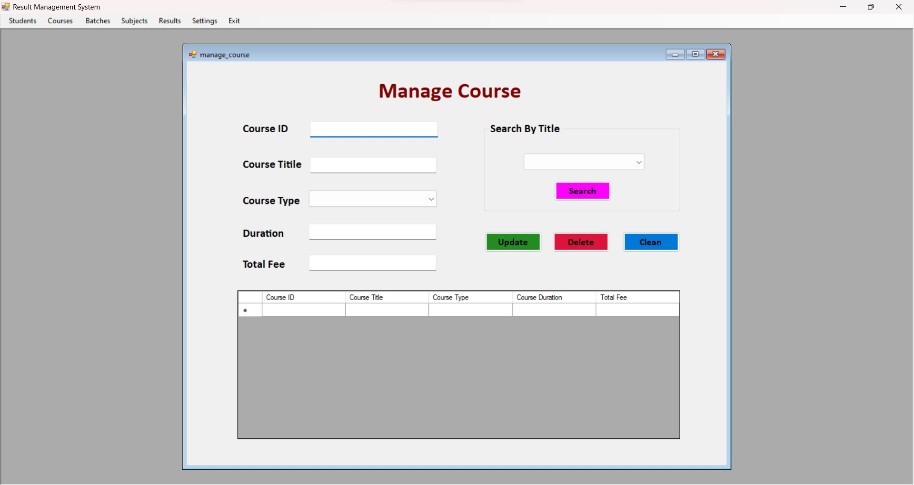


### Batches Module

#### Add Batches Module

##### Features
- Add batches.
- Gridview of added batches.

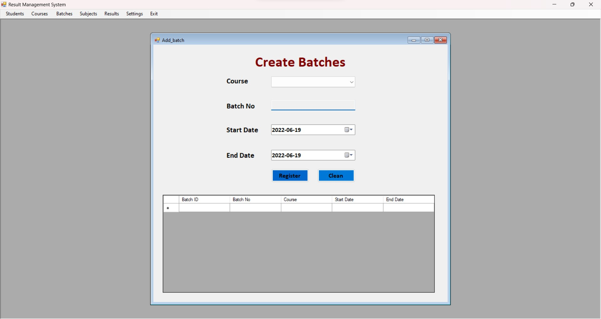


#### Manage Batches Module

##### Features
- Delete batches.
- Update batches.
- Search batches.
- Gridview of added batches.

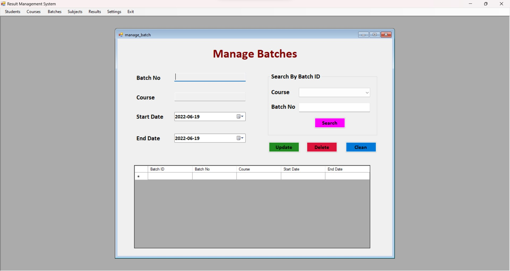


### Subjects Module

#### Add Subjects Module

##### Features
- Add subjects.
- Gridview of added subjects.

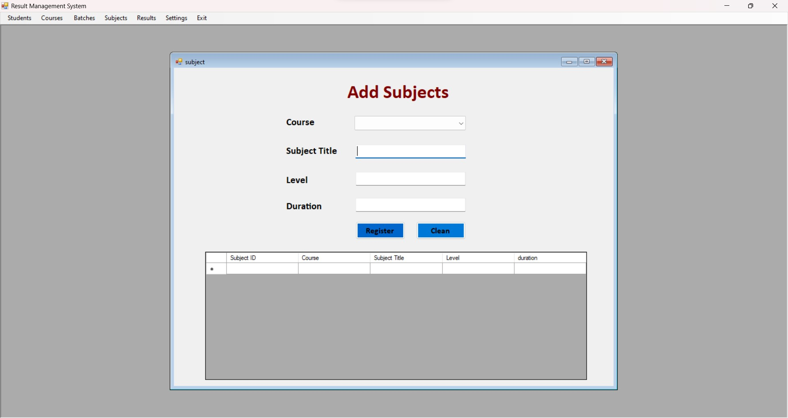


#### Manage Subjects Module

##### Features
- Delete subjects.
- Update subjects.
- Search subjects.
- Gridview of added subjects.

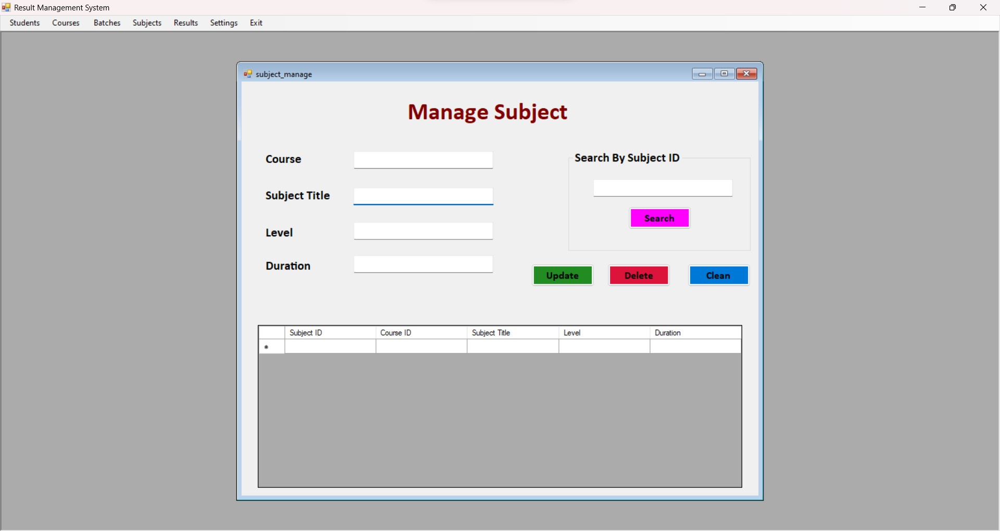


#### Show All Subjects Module

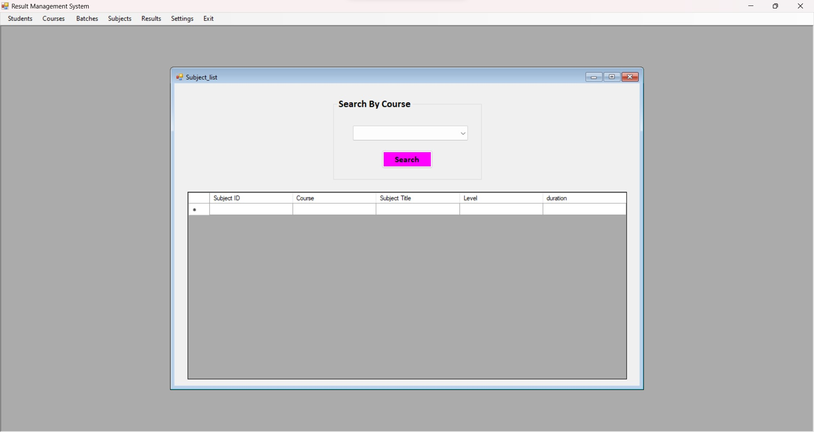


### Results Module

#### Add Results Module

##### Features
- provide results.
- Gridview of added results.

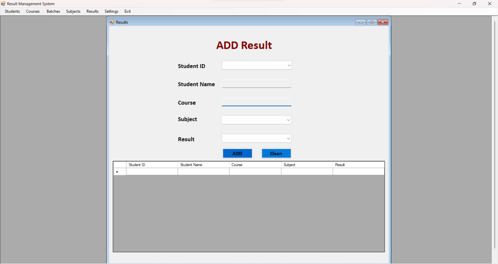


#### Manage Results Module

##### Features
- Filter search
- Serach results.
- Gridview of added results.


### Settings

##### Features
- Feature to change username.
- Feature to change password.
- Feature to backup database.
- Feature to restore database.

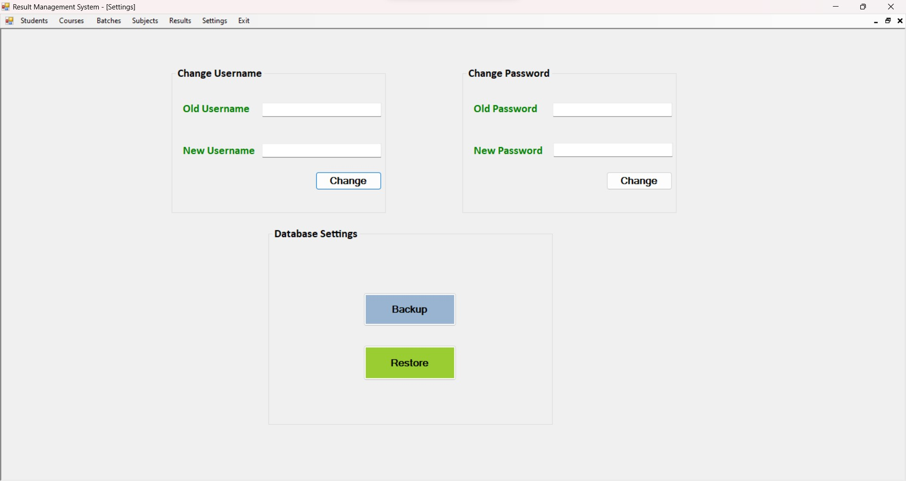


## Execution

### Step 01:

**Note:** Execute the following exe.

```
1-source\result_management\bin\Debug\result_management.exe
```

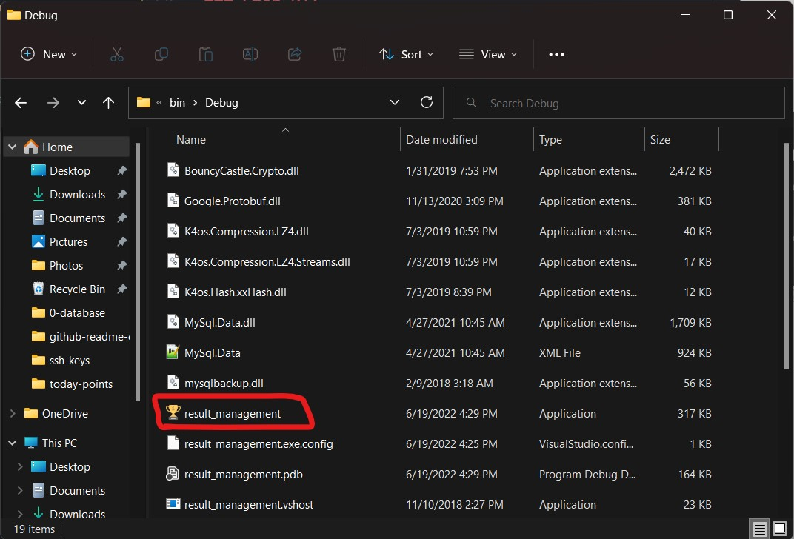

### Step 02:

**Note:** Open the project in Visual Studio.

```
1-source\result_management.sln
```


# Contact

### 🌐 Website:
[](https://www.mpowerr.com)

---

### 📱 Social Media:

[](https://www.linkedin.com/company/mpowerr-info)
[](https://www.facebook.com/mpowerr.info)
[](https://www.instagram.com/mpowerr.info)
[](https://x.com/MpowerrInfo)
[](https://www.tiktok.com/@mpowerr.info)
[](https://www.youtube.com/@mpowerrinfo)

---
